# Setting Up Steam Link On A Raspberry Pi 4 Model B Device
For the last week or so, I've been trying to setup [Steam Link](https://store.steampowered.com/app/353380/Steam_Link/) on my [Raspberry Pi 4 Model B](https://www.amazon.com/Raspberry-Model-2019-Quad-Bluetooth/dp/B07TC2BK1X) devices. Along the way, I've ran into a few issues, some in which are documented in a separate GitHub repository I made [here](https://github.com/gamemann/Steam-Link-Setup-And-Issues-On-Raspberry-Pi). Unfortunately, I found that information on the Internet related to setting up Steam Link on a Raspberry Pi is very scattered and scarce, especially when wanting to stream at **120 FPS/Hz**, which is still fairly new to Steam Link. With that said, I also found that newer OS releases of the Raspberry Pi OS either have bad performance with Steam Link or doesn't work at all. That is why we will be using a legacy version of Raspberry Pi OS, **Buster Lite**, which runs on 32-bit.

My main goal was to stream games from my gaming desktop to a new gaming projector I recently purchased called the [BenQ TH685P](https://www.amazon.com/dp/B09V22YRMJ) using Steam Link on my Raspberry Pi. I wanted to stream at `1920x1080` @ **120**Hz/FPS.

**Disclaimer** - I apologize for any pictures that have bad quality when taken from my phone.

## Setup
I **strongly** recommend using a wired connection for both your computer you want to stream from and your Raspberry Pi device that will be running Steam Link. Even when your Raspberry Pi is right next to your router/wireless access point, using wireless will still likely result in hiccups every once and a while causing noticeable performance issues.

### Gaming Desktop
My gaming desktop has the following specs.

* Windows 11 (22H2)
* RTX 3090 TI
* AMD Ryzen 9 5900X (12c/24t)
* 64 GBs DDR4 RAM
* 2 x 2 TBs NVMe (Samsung 970 EVO and Samsung 980 PRO)
* 1 gbps on-board NIC (wired)

### Projector
I have a [BenQ TH685P](https://www.amazon.com/dp/B09V22YRMJ) projector that I want to stream games to using Steam Link. It supports running at **120Hz/FPS** at 1080p!

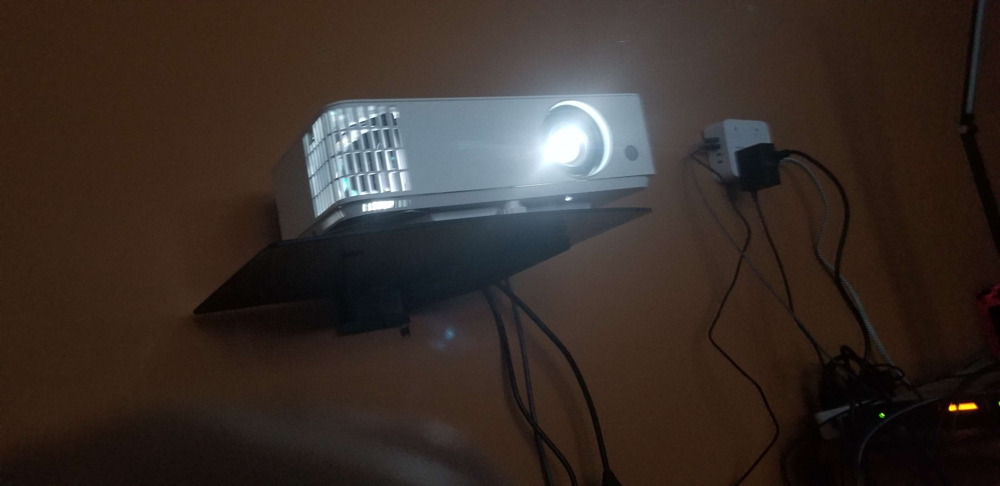

### Raspberry Pi 4 Model B
I'm setting up Steam Link on a [Raspberry Pi 4 Model B](https://www.amazon.com/Raspberry-Model-2019-Quad-Bluetooth/dp/B07TC2BK1X) device with 4 cores and 4 GBs of RAM.

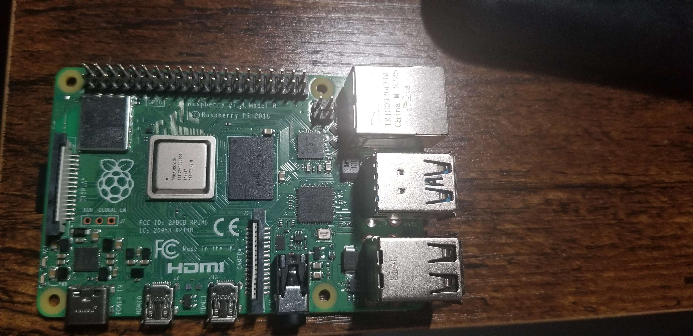
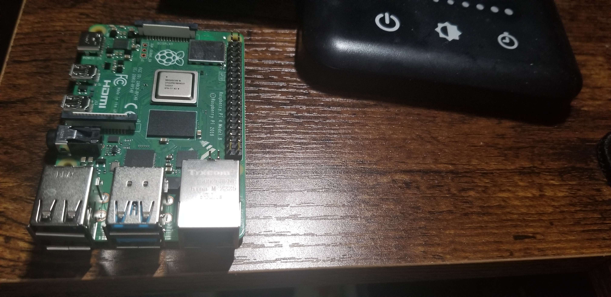

### MicroSD Card & Flasher
I am using a SanDisk 128 GBs MicroSD card with a USB flasher from Anker.

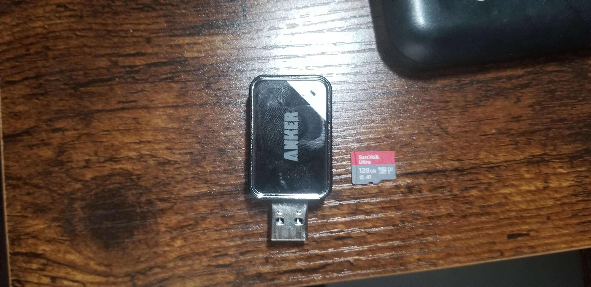

### Controller
I am using an [Xbox Core Wireless Controller](https://www.amazon.com/gp/product/B08DF248LD) (Carbon Black) with BlueTooth.

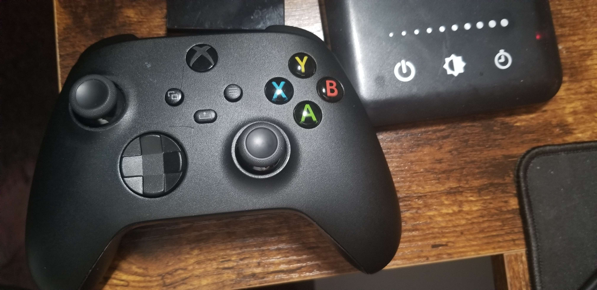

### Monitor For Testing
I use an [Acer KC242Y](https://www.amazon.com/dp/B0BS9T3FNB) monitor (`1920x1080` @ 100Hz) with a KVM switch (between my Raspberry Pi and one of my home servers) when setting up Raspberry Pi devicces since this allows me to use a keyboard/mouse easily. After setting up the Raspberry Pi, I then connect it to my projector since I wouldn't need a keyboard/mouse at that point.

## Flashing MicroSD Card & Installing Raspberry Pi OS
As mentioned in the overview, we will be using Raspberry Pi OS **Buster Lite** in this guide. This is because from the experiments I've concluded, Steam Link on Bookworm has broken packages and Steam Link on Bullseye has noticeably bad performance (high display latency and frame loss).

### Download & Install Raspberry Pi Imager
Firstly, you'll want to download Raspberry Pi Imager from [here](https://www.raspberrypi.com/software/). This program allows you to easily flash your MicroSD card with a new Raspberry Pi OS.

### Download Raspberry Pi OS Buster Lite
Next, you'll want to download the Raspberry Pi OS Buster Lite image file from [here](https://downloads.raspberrypi.org/raspios_oldstable_lite_armhf/images/raspios_oldstable_lite_armhf-2022-04-07/). A direct link to `2022-04-04-raspios-buster-armhf-lite.img.xz` may be found [here](https://downloads.raspberrypi.org/raspios_oldstable_lite_armhf/images/raspios_oldstable_lite_armhf-2022-04-07/2022-04-04-raspios-buster-armhf-lite.img.xz). 

After downloading the file, you will need to extract the image file using a program such as [7-Zip](https://www.7-zip.org/) that supports uncompressing `.xz` files.

### Flash Raspberry Pi OS Buster Lite
Now, you'll want to open Raspberry Pi Imager and you should see something like below.


Click the "Choose OS" button under the "Operating System" text and this will open a new scrollable menu. Scroll down to the bottom of the menu and choose "Use custom".

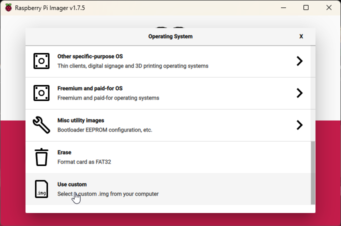

Now you'll want to select the Raspberry Pi OS Buster Lite image file you extracted from earlier.

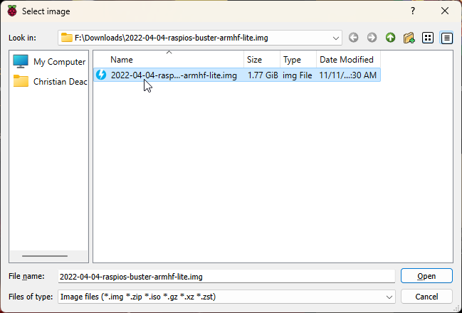

Afterwards, click the "Choose Storage" button under the "Storage" text. You will now select the MicroSD card you want to flash the OS to.

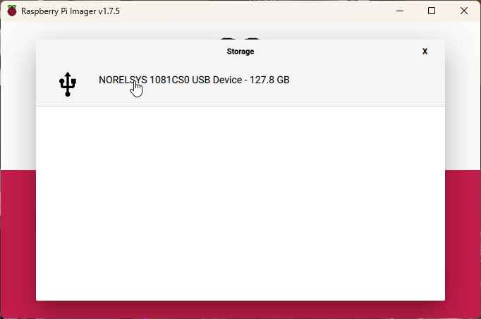

You should now be able to click the "Write" button to flash the image to the MicroSD card.

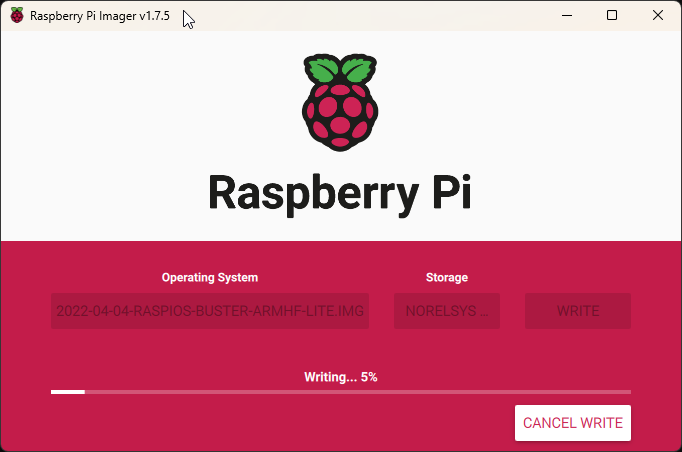

This will take a minute or two depending on the speed of your MicroSD card. A popup like below will show once the image is written to the MicroSD card.


You may hit continue and take out your MicroSD card. You'll want to insert your MicroSD card into your Raspberry Pi like below.

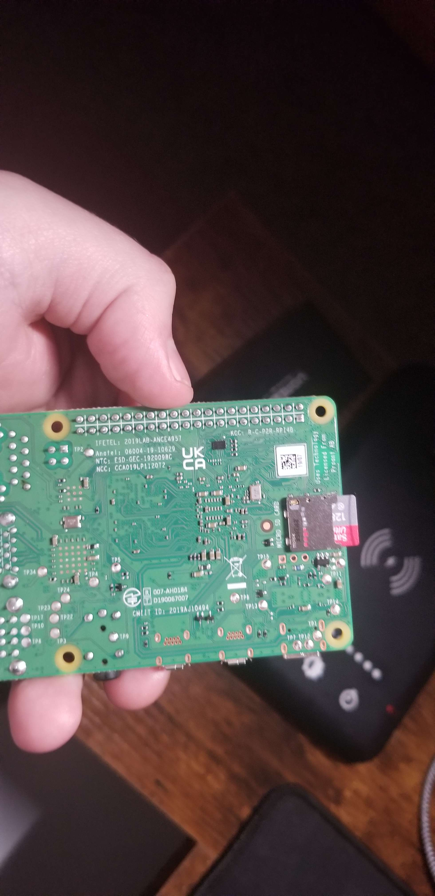

### Connect Raspberry Pi To Monitor And Boot
You'll now want to connect your Raspberry Pi to your monitor or projector. You will need a keyboard and mouse connected to the Raspberry Pi for the initial setup steps. We will be trying to use SSH as much as possible when the time comes. In this guide, I will be using my monitor for testing to setup the Raspberry Pi itself, but after it is setup, I will be plugging it into my projector.


## Login & Enabling OpenSSH
After booting your Raspberry Pi, you will need to login. The default username is `pi` and the default password is `raspberry`.

The first thing you'll want to do after logging in is enabling OpenSSH. OpenSSH will allow you to SSH to the Raspberry Pi from your computer using a Linux terminal such as [PuTTY](https://www.putty.org/) or [MobaXterm](https://mobaxterm.mobatek.net/) (what I personally use).

To enable OpenSSH, first you'll want to execute the `sudo raspi-config` command which will open a menu showing utilities and settings for the Raspberry Pi.

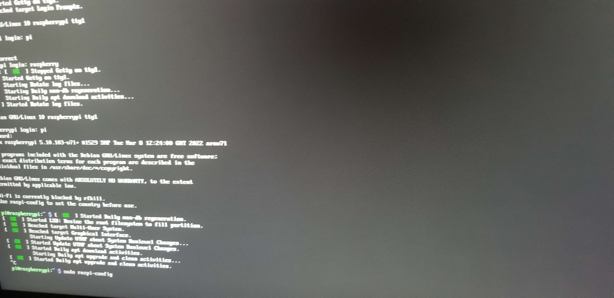

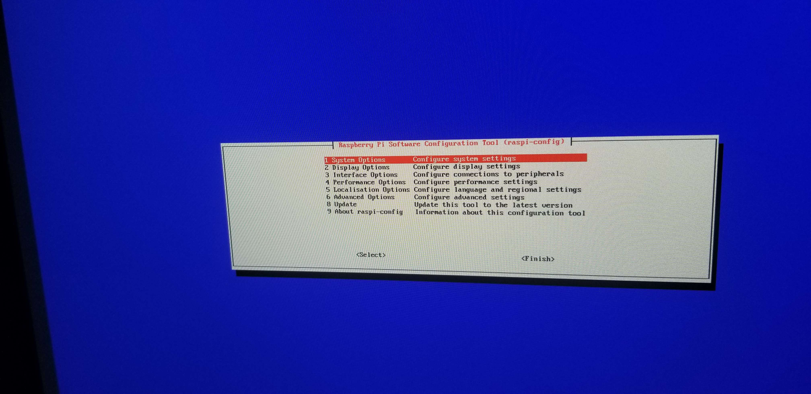

Next, use your arrow keys to go down to "Interface Options" and then hit enter to select. This will bring up a menu like the following.

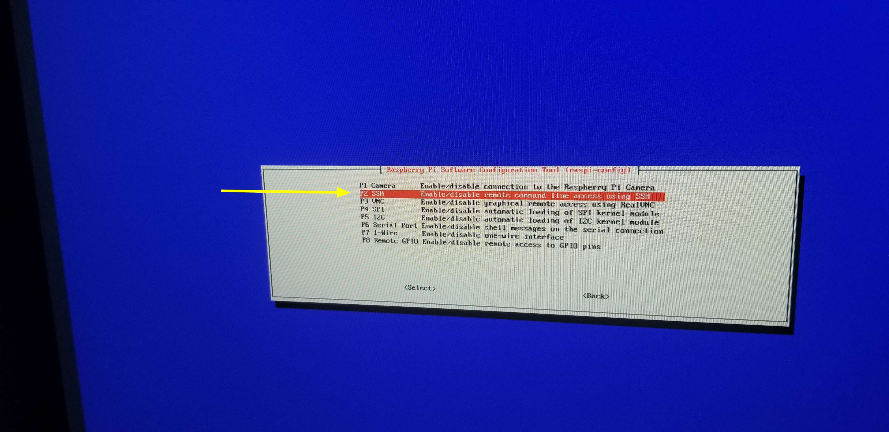

Now, use your arrow keys to go down to "P2 SSH" and then hit enter to seelct. This will prompt you to enable or disable SSH. Make sure to select yes.

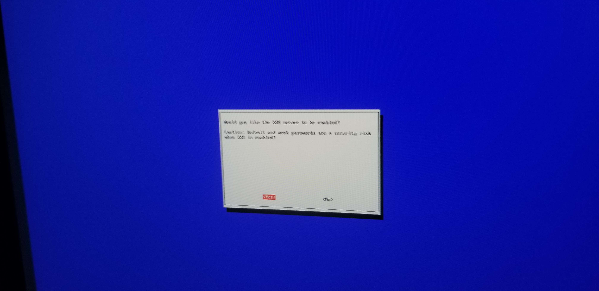

Once you've enabled SSH, it will show the following. Afterwards, you can hit enter to go back to the main menu.

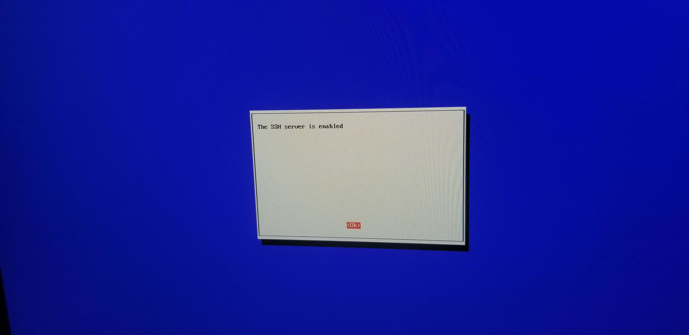

Now you should be able to SSH to your Raspberry Pi assuming it belongs to the same network as your computer that you want to SSH from. While this isn't *required*, it will make troubleshooting issues easier, **especially** after you enable a `systemd` service that automatically restarts Steam Link each time it closes on the main TTY.

You can find the IP of your Raspberry Pi using the `ip a` or `ifconfig` commands.

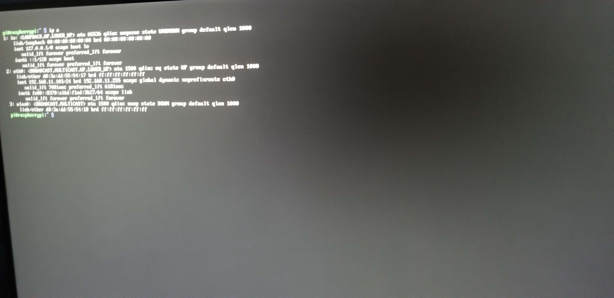

In this case, the IP of my Raspberry Pi device is `192.168.11.103` which I have running under its own VLAN. You can SSH to your Raspberry Pi using a Linux terminal with the following command.

```bash
ssh pi@192.168.11.103
```

Obviously, you'll want to replace `192.168.11.103` with your IP address.

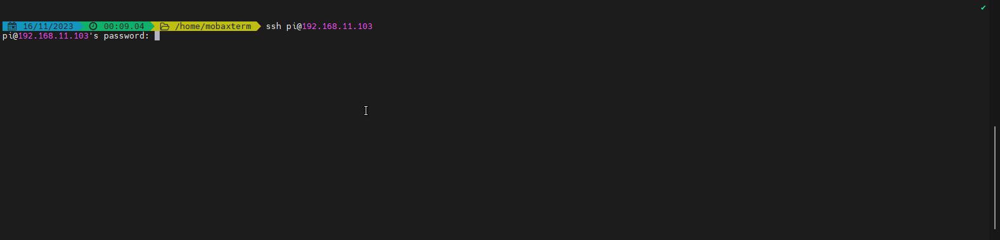

## Change User Password, & Update Device
The first thing you'll want to do after logging in through SSH is changing your `pi` user's password. While it isn't *required*, if you expose OpenSSH on your Raspberry Pi to the Internet with `raspberry` as the password, you are potentially risking security of your devices depending on what your Raspberry Pi device has access to on your network. If you only have the Raspberry Pi device operating on your LAN and can't be bothered to change the password, you can skip this step if you want to without any security risks.

You can change the user password by executing the `passwd` command, typing in the current user's password (`raspberry`), and then typing in your new password twice.

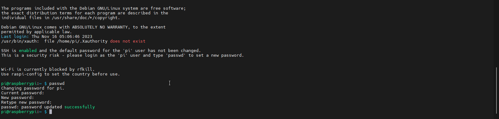

Next, you'll want to update/upgrade the current system using the following command.

```bash
sudo apt update && sudo apt upgrade -y
```

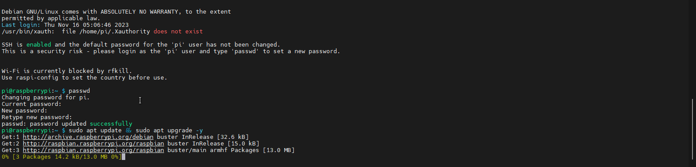


