# Setting Up Steam Link On A Raspberry Pi 4 Model B Device
*Work In Progress*

For the last week or so, I've been trying to setup [Steam Link](https://store.steampowered.com/app/353380/Steam_Link/) on my [Raspberry Pi 4 Model B](https://www.amazon.com/Raspberry-Model-2019-Quad-Bluetooth/dp/B07TC2BK1X) devices. Along the way, I've ran into a few issues, some in which are documented in a separate GitHub repository I made [here](https://github.com/gamemann/Steam-Link-Setup-And-Issues-On-Raspberry-Pi). Unfortunately, I found that information on the Internet related to setting up Steam Link on a Raspberry Pi is very scattered and scarce, especially when wanting to stream at **120 FPS/Hz**, which is still fairly new to Steam Link. With that said, I also found that newer OS releases of the Raspberry Pi OS either have bad performance with Steam Link or doesn't work at all. That is why we will be using a legacy version of Raspberry Pi OS, **Buster Lite**, which runs on 32-bit.

My main goal was to stream games from my gaming desktop to a new gaming projector I recently purchased called the [BenQ TH685P](https://www.amazon.com/dp/B09V22YRMJ) using Steam Link on my Raspberry Pi. I wanted to stream at `1920x1080` @ **120**Hz/FPS. While my goal was to stream at 120Hz, this guide should also work for refresh rates up to 144Hz since that's the highest Steam Link supports at this moment.

**Disclaimer** - I apologize for any pictures that have bad quality when taken from my phone.

## Setup
I **strongly** recommend using a wired connection for both your computer you want to stream from and your Raspberry Pi device that will be running Steam Link. Even when your Raspberry Pi is right next to your router/wireless access point, using wireless will still likely result in hiccups every once and a while causing noticeable performance issues.

### Gaming Desktop
My gaming desktop has the following specs.

* Windows 11 (22H2)
* RTX 3090 TI
* AMD Ryzen 9 5900X (12c/24t)
* 64 GBs DDR4 RAM
* 2 x 2 TBs NVMe (Samsung 970 EVO and Samsung 980 PRO)
* 1 gbps on-board NIC (wired)

### Projector
I have a [BenQ TH685P](https://www.amazon.com/dp/B09V22YRMJ) projector that I want to stream games to using Steam Link. It supports running at **120Hz/FPS** at 1080p!


### Raspberry Pi 4 Model B
I'm setting up Steam Link on a [Raspberry Pi 4 Model B](https://www.amazon.com/Raspberry-Model-2019-Quad-Bluetooth/dp/B07TC2BK1X) device with 4 cores and 4 GBs of RAM.


### MicroSD Card & Flasher
I am using a SanDisk 128 GBs MicroSD card with a USB flasher from Anker.


### Controller
I am using an [Xbox Core Wireless Controller](https://www.amazon.com/gp/product/B08DF248LD) (Carbon Black) with BlueTooth.


### Monitor For Testing
I use an [Acer KC242Y](https://www.amazon.com/dp/B0BS9T3FNB) monitor (`1920x1080` @ 100Hz) with a KVM switch (between my Raspberry Pi and one of my home servers) when setting up Raspberry Pi devicces since this allows me to use a keyboard/mouse easily. After setting up the Raspberry Pi, I then connect it to my projector since I wouldn't need a keyboard/mouse at that point.

## Flashing MicroSD Card & Installing Raspberry Pi OS
As mentioned in the overview, we will be using Raspberry Pi OS **Buster Lite** in this guide. This is because from the experiments I've concluded, Steam Link on Bookworm has broken packages and Steam Link on Bullseye has noticeably bad performance (high display latency and frame loss).

### Download & Install Raspberry Pi Imager
Firstly, you'll want to download Raspberry Pi Imager from [here](https://www.raspberrypi.com/software/). This program allows you to easily flash your MicroSD card with a new Raspberry Pi OS.

### Download Raspberry Pi OS Buster Lite
Next, you'll want to download the Raspberry Pi OS Buster Lite image file from [here](https://downloads.raspberrypi.org/raspios_oldstable_lite_armhf/images/raspios_oldstable_lite_armhf-2022-04-07/). A direct link to `2022-04-04-raspios-buster-armhf-lite.img.xz` may be found [here](https://downloads.raspberrypi.org/raspios_oldstable_lite_armhf/images/raspios_oldstable_lite_armhf-2022-04-07/2022-04-04-raspios-buster-armhf-lite.img.xz). 

After downloading the file, you will need to extract the image file using a program such as [7-Zip](https://www.7-zip.org/) that supports uncompressing `.xz` files.

### Flash Raspberry Pi OS Buster Lite
Now, you'll want to open Raspberry Pi Imager and you should see something like below.


Click the "Choose OS" button under the "Operating System" text and this will open a new scrollable menu. Scroll down to the bottom of the menu and choose "Use custom".


Now you'll want to select the Raspberry Pi OS Buster Lite image file you extracted from earlier.


Afterwards, click the "Choose Storage" button under the "Storage" text. You will now select the MicroSD card you want to flash the OS to.


You should now be able to click the "Write" button to flash the image to the MicroSD card.


This will take a minute or two depending on the speed of your MicroSD card. A popup like below will show once the image is written to the MicroSD card.


You may hit continue and take out your MicroSD card. You'll want to insert your MicroSD card into your Raspberry Pi like below.


### Connect Raspberry Pi To Monitor And Boot
You'll now want to connect your Raspberry Pi to your monitor or projector. You will need a keyboard and mouse connected to the Raspberry Pi for the initial setup steps. We will be trying to use SSH as much as possible when the time comes. In this guide, I will be using my monitor for testing to setup the Raspberry Pi itself, but after it is setup, I will be plugging it into my projector.


## Login & Enabling OpenSSH
After booting your Raspberry Pi, you will need to login. The default username is `pi` and the default password is `raspberry`.

The first thing you'll want to do after logging in is enabling OpenSSH. OpenSSH will allow you to SSH to the Raspberry Pi from your computer using a Linux terminal such as [PuTTY](https://www.putty.org/) or [MobaXterm](https://mobaxterm.mobatek.net/) (what I personally use).

To enable OpenSSH, first you'll want to execute the `sudo raspi-config` command which will open a menu showing utilities and settings for the Raspberry Pi.


Next, use your arrow keys to go down to "Interface Options" and then hit enter to select. This will bring up a menu like the following.


Now, use your arrow keys to go down to "P2 SSH" and then hit enter to select. This will prompt you to enable or disable SSH. Make sure to select yes.


Once you've enabled SSH, it will show the following. Afterwards, you can hit enter to go back to the main menu.


Now you should be able to SSH to your Raspberry Pi assuming it belongs to the same network as your computer that you want to SSH from. While this isn't *required*, it will make troubleshooting issues easier, **especially** after you enable a `systemd` service that automatically restarts Steam Link each time it closes on the main TTY.

You can find the IP of your Raspberry Pi using the `ip a` or `ifconfig` commands.


In this case, the IP of my Raspberry Pi device is `192.168.11.103` which I have running under its own VLAN. You can SSH to your Raspberry Pi using a Linux terminal with the following command.

```bash
ssh pi@192.168.11.103
```

Obviously, you'll want to replace `192.168.11.103` with your IP address.


## Change User Password, & Update Device
The first thing you'll want to do after logging in through SSH is changing your `pi` user's password. While it isn't *required*, if you expose OpenSSH on your Raspberry Pi to the Internet with `raspberry` as the password, you are potentially risking security of your devices depending on what your Raspberry Pi device has access to on your network. If you only have the Raspberry Pi device operating on your LAN and can't be bothered to change the password, you can skip this step if you want to without any security risks.

You can change the user password by executing the `passwd` command, typing in the current user's password (`raspberry`), and then typing in your new password twice.


Next, you'll want to update/upgrade the current system using the following command.

```bash
sudo apt update && sudo apt upgrade -y
```


## Setting Up Autologin
As of right now, when you boot your Raspberry Pi device, it will require you to login from the main TTY connected to your monitor or projector. This would become annoying when trying to use the Steam Link, so you'll want to set it so that it automatically logs into the user `pi` at the main TTY. To do this, execute the `sudo raspi-config` command and select "System Options".

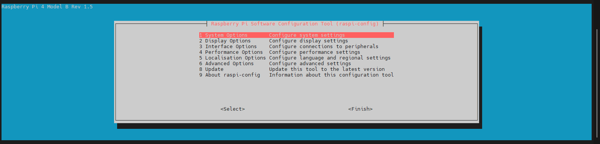


Next, use your arrow keys to select the "S5 Boot / Auto Login" option and hit enter.


You'll want to select the second option which is named "B2 Console Autologin Text Console, automatically logged in as 'pi' user".


After hitting enter, it will bring you back to the main menu and you'll want to select "Finish".

## Allocating More GPU Memory
By default, only 16 MBs of GPU memory is allocated to the Raspberry Pi OS. Steam Link recommends *at least* 128 MBs which should be more than enough. However, I allocate 256 MBs just to be safe since Steam Link is the only application with a GUI I have running anyways.

To allocate more memory, first execute the `sudo raspi-config` command to bring up the utilities menu and use your arrow keys to select "Performance Options". Afterwards, hit enter.

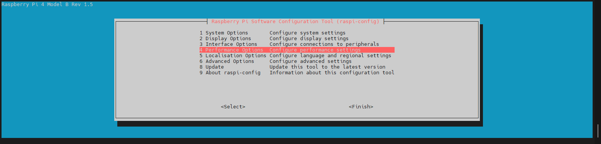

Next, use your arrow keys to select "GPU Memory" and hit enter.


You will want to input either `128` or `256`.


Afterwards, use your arrow keys to select "Ok" and hit enter to save.


## Enabling 4K60
While I don't believe I *needed* this for my setup since I'm streaming at 1080P @ 120Hz, I still recommend enabling the 4K 60Hz option just to be safe with your setup.

To enable this option, firstly, execute the `sudo raspi-config` command to bring up the utilities menu and use your arrow keys to select "Advanced Options". Afterwards, hit enter.

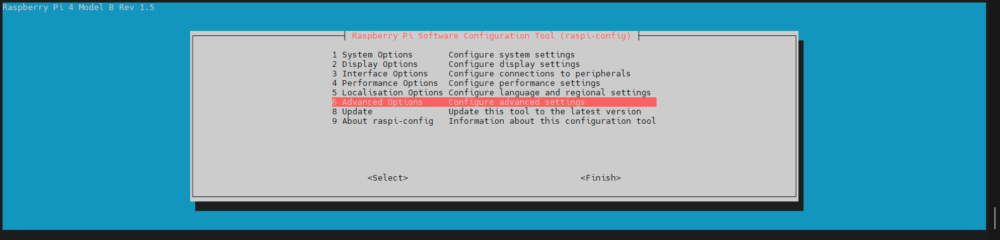

Next, use your arrow keys to select "HDMI / Composite" and hit enter.


Now hit enter on "Enable 4Kp60 HDMI".


You should receive a message stating the feature was enabled.


## Make FKMS Support Over 60FPS
FKMS is the video driver the Raspberry Pi uses, but has issues with running over 60FPS out of the box. Therefore, you need to edit a file located at `/boot/cmdline.txt` and prepend `vc4.fkms_max_refresh_rate=<maxFPS>`. In my case, since I'm streaming at 120Hz, I prepended `vc4.fkms_max_refresh_rate=120`.

To edit the file, you can use a text editor called Nano via the `nano /boot/cmdline.txt` command.


You should see something like this.

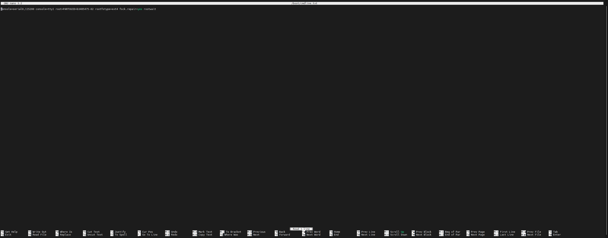


Now, prepend the value from above so that the single line looks something like below.

```
vc4.fkms_max_refresh_rate=120 console=serial0,115200 console=tty1 root=PARTUUID=b3485475-02 rootfstype=ext4 fsck.repair=yes rootwait
```

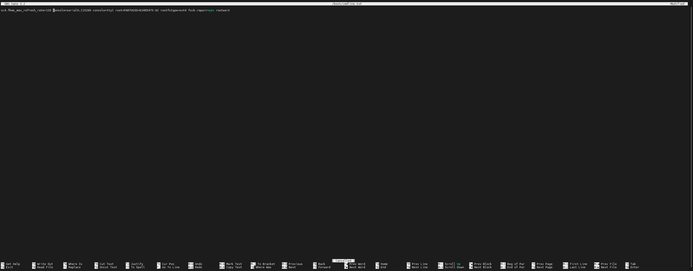

Afterwards, hit `CTRL` + `X` and then `Y` to save the file.

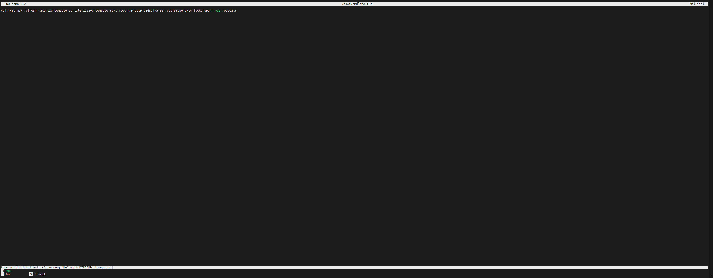

## Enable Other Useful Config Options
There are a few other HDMI-specific settings I enabled manually by editing the `/boot/config.txt` file directly. You can edit the Raspberry Pi config file by using Nano via the `nano /boot/config.txt` command.

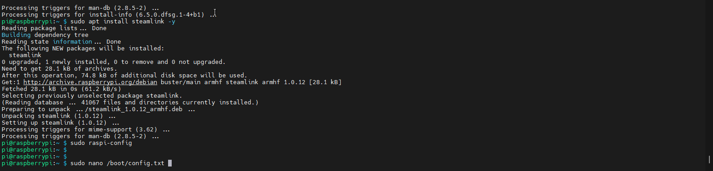

When editing this file, you'll want to uncomment the following lines by removing the `#` in-front.

```bash
# hdmi_force_hotplug=1
# hdmi_drive=2
# config_hdmi_boost=4
```

* `hdmi_force_hotplug=1` - To my understanding, this forces the Raspberry Pi to keep trying to detect for a video source from HDMI if not detected already. When I had this disabled, I would constantly need to restart my Raspberry Pi due to the video source not re-detecting. This happened a lot because Steam Link would result in the HDMI source going out and in when starting up.
* `hdmi_drive=2` - This setting helps with HDMI audio. I don't know if it is really required, but it didn't hurt enabling it.
* `config_hdmi_boost=4` - This setting boosts the HDMI signal. I had an issue where streaming at 120Hz to my projector resulted in my projector losing signal to the HDMI source immediately and I believe this setting corrected the issue.

Your config file should look something like this now.

```bash
# For more options and information see
# http://rpf.io/configtxt
# Some settings may impact device functionality. See link above for details

# uncomment if you get no picture on HDMI for a default "safe" mode
#hdmi_safe=1

# uncomment this if your display has a black border of unused pixels visible
# and your display can output without overscan
#disable_overscan=1

# uncomment the following to adjust overscan. Use positive numbers if console
# goes off screen, and negative if there is too much border
#overscan_left=16
#overscan_right=16
#overscan_top=16
#overscan_bottom=16

# uncomment to force a console size. By default it will be display's size minus
# overscan.
#framebuffer_width=1280
#framebuffer_height=720

# uncomment if hdmi display is not detected and composite is being output
hdmi_force_hotplug=1

# uncomment to force a specific HDMI mode (this will force VGA)
# hdmi_group=1
# hdmi_mode=63

# uncomment to force a HDMI mode rather than DVI. This can make audio work in
# DMT (computer monitor) modes
hdmi_drive=2

# uncomment to increase signal to HDMI, if you have interference, blanking, or
# no display
config_hdmi_boost=4

# uncomment for composite PAL
#sdtv_mode=2

#uncomment to overclock the arm. 700 MHz is the default.
#arm_freq=800

# Uncomment some or all of these to enable the optional hardware interfaces
#dtparam=i2c_arm=on
#dtparam=i2s=on
#dtparam=spi=on

# Uncomment this to enable infrared communication.
#dtoverlay=gpio-ir,gpio_pin=17
#dtoverlay=gpio-ir-tx,gpio_pin=18

# Additional overlays and parameters are documented /boot/overlays/README

# Enable audio (loads snd_bcm2835)
dtparam=audio=on

[pi4]
# Enable DRM VC4 V3D driver on top of the dispmanx display stack
dtoverlay=vc4-fkms-v3d
max_framebuffers=2

[all]
#dtoverlay=vc4-fkms-v3d
gpu_mem=256
hdmi_enable_4kp60=1
```

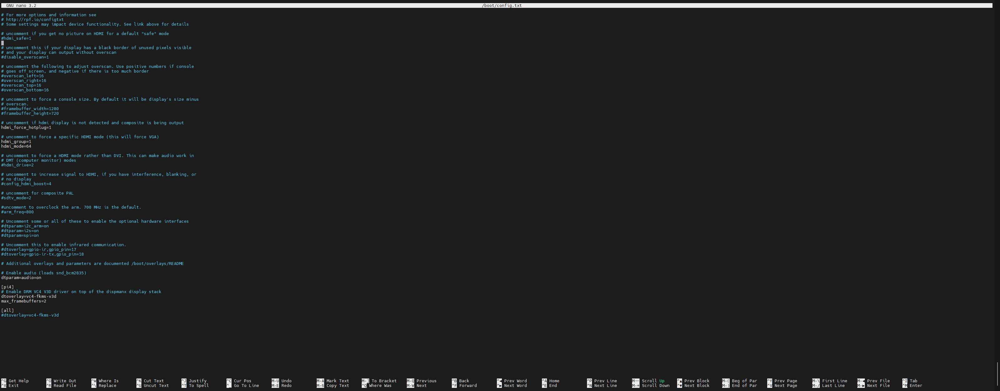

Afterwards, hit `CTRL` + `X` and then hit `Y` to save the file.

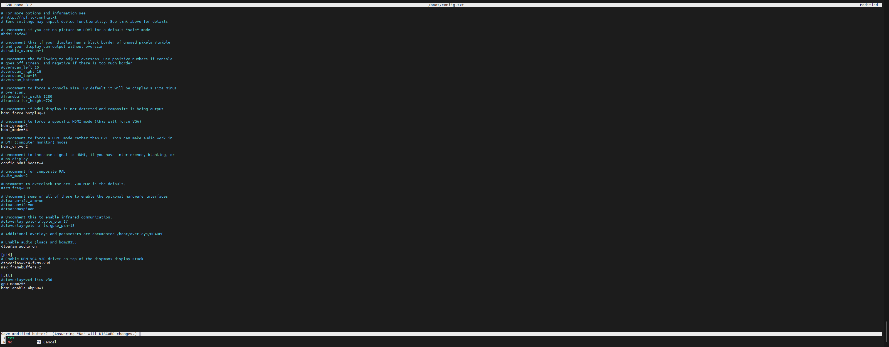

## Setting Display Resolution
You will most likely need to perform this step every time you connect your Raspberry Pi to a new video output with different resolutions and refresh rates unless if the video output automatically detected the best resolution and refresh rate (it did not in my case; My projector thought `2160P@30Hz` was acceptable for gaming in that case!).

To set the proper resolution and refresh rate, execute the `sudo raspi-config` command and use your arrow keys to select `Display Options`. Afterwards, hit enter.

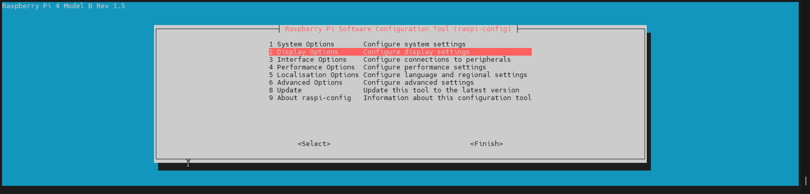


Next, select "Resolution" and hit enter.

You will want to find the best resolution and refresh rate for your video output in the menu.


Afterwards, select "Ok" and hit enter.


## Setting Up Controllers
If you don't plan to use a controller, you may skip this step. I am using an Xbox Core Wireless Controller with BlueTooth.

### Install Xpadneo
Firstly, you will want to install a Linux driver for controllers called [xpadneo](https://github.com/atar-axis/xpadneo).

You may execute the following commands to do so.

```bash
# Install Git and Raspberry Pi kernel headers
sudo apt install -y git dkms raspberrypi-kernel-headers

# Clone xpadneo via Git
git clone https://github.com/atar-axis/xpadneo.git

# Change to xpadneo/ directory
cd xpadneo

# Execute install script
sudo ./install.sh
```

If you want to uninstall the driver, you may use the following command.

```bash
sudo ./uninstall.sh
```

### Pairing Through Bluetooth
You'll now want to pair the controller through BlueTooth, unless if you want to use a USB cable (if that's the case, you may skip this step).

You can execute `sudo bluetoothctl` to jump into the BlueTooth CLI.

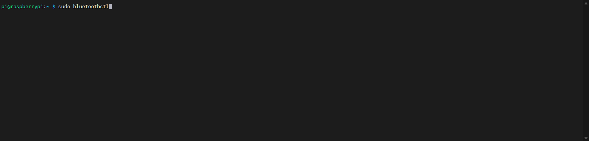

Next, you'll want to execute the following commands. Please keep in mind lines starting with `#` are just comments and should be ignored.

```bash
# Set default agent.
default-agent

# Start scanning for new devices
scan on
```

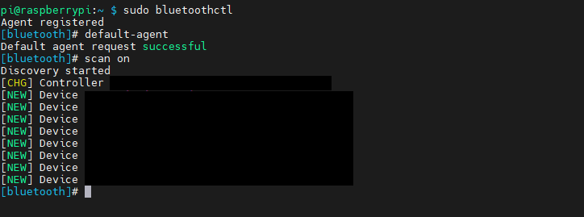

You will see a list of all BlueTooth devices near by. You will want to start pairing the controller at this time.

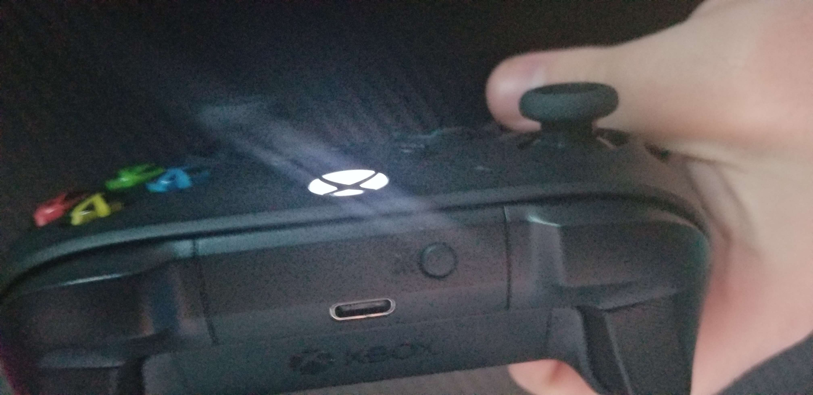

Once you see the controller show up, you will want to copy the MAC address which looks like `xx:xx:xx:xx:xx:xx` where each `x` is a random letter or number.

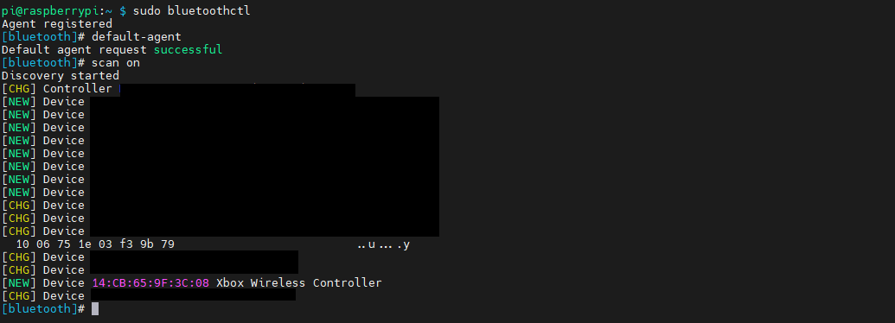

You will now want to use the following command to attempt to connect to the controller.

```bash
connect <mac address>
```

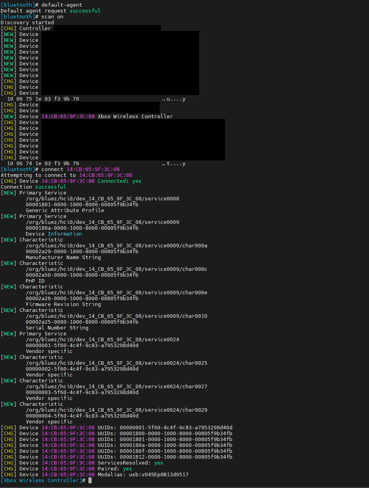

Asssuming the connection succeeds (light stops blinking and is steady along with controller vibrations indicating connection), you will then want to trust the device so that once it disconnects, it will be able to reconnect automatically in the future.

```bash
trust <mac address>
```

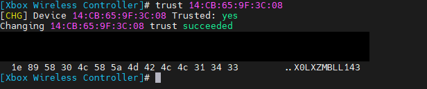

There you have it! You should be able to use your controller in the next steps.

## Installing Steam Link
You can now install Steam Link by using the following command.

```bash
sudo apt install -y steamlink
```

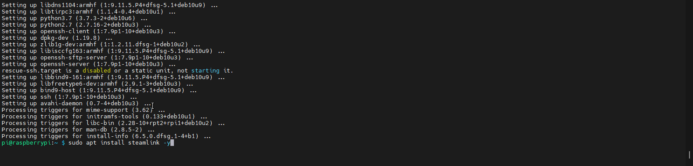

You will now have to go back to your keyboard/mouse connected to your Raspberry Pi and execute the `steamlink` command for the first time. This will install the rest of the depedencies and such. You will need to hit enter a few times and type `Y` at some point when installing the new packages.

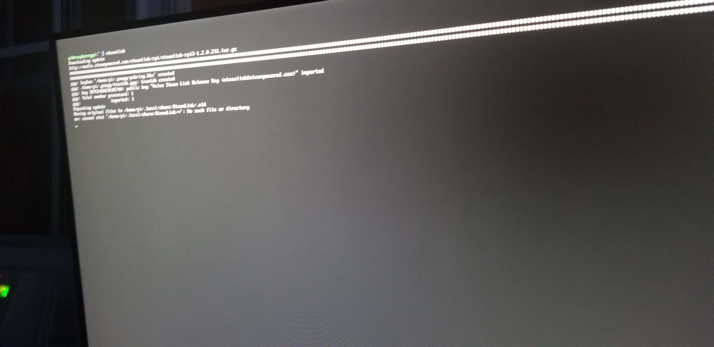

Once the packages are installed, Steam Link should start with a welcome message!

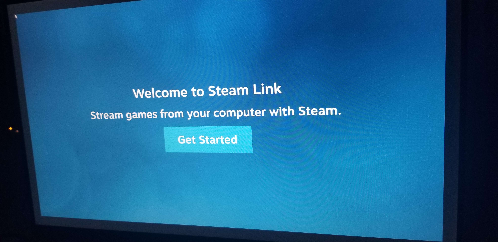

## Pairing Steam Link With Your Computer
After hitting the "Get Started" button from the welcome message, you will either see existing computers on your network you can stream from or none. This depends on your network setup, but since my Steam Link is set up on its own VLAN, it couldn't find any existing computers. Therefore, I needed to hit the "Other Computer" button located at the bottom and pair my computer manually.

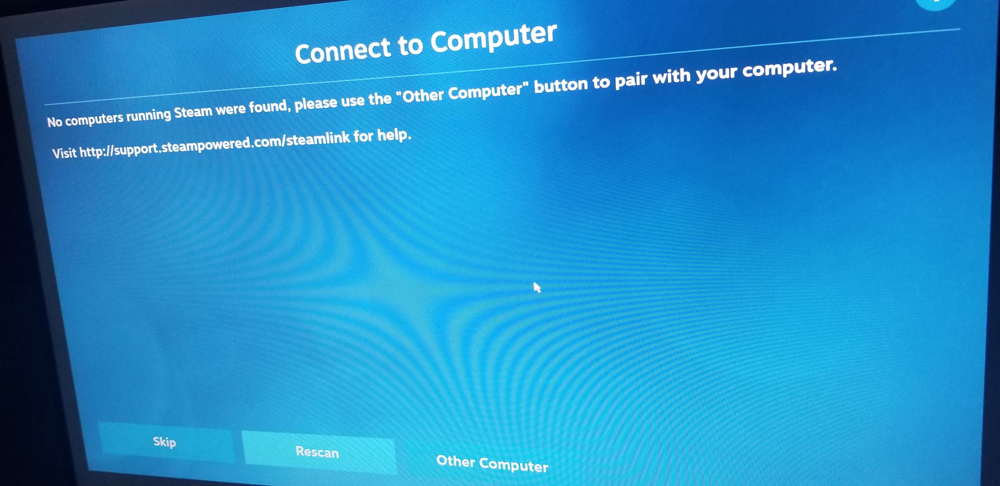

This will show a pin like below.

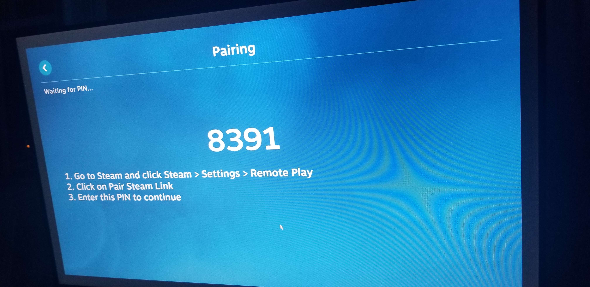

You will now need to open your Steam settings on your computer.

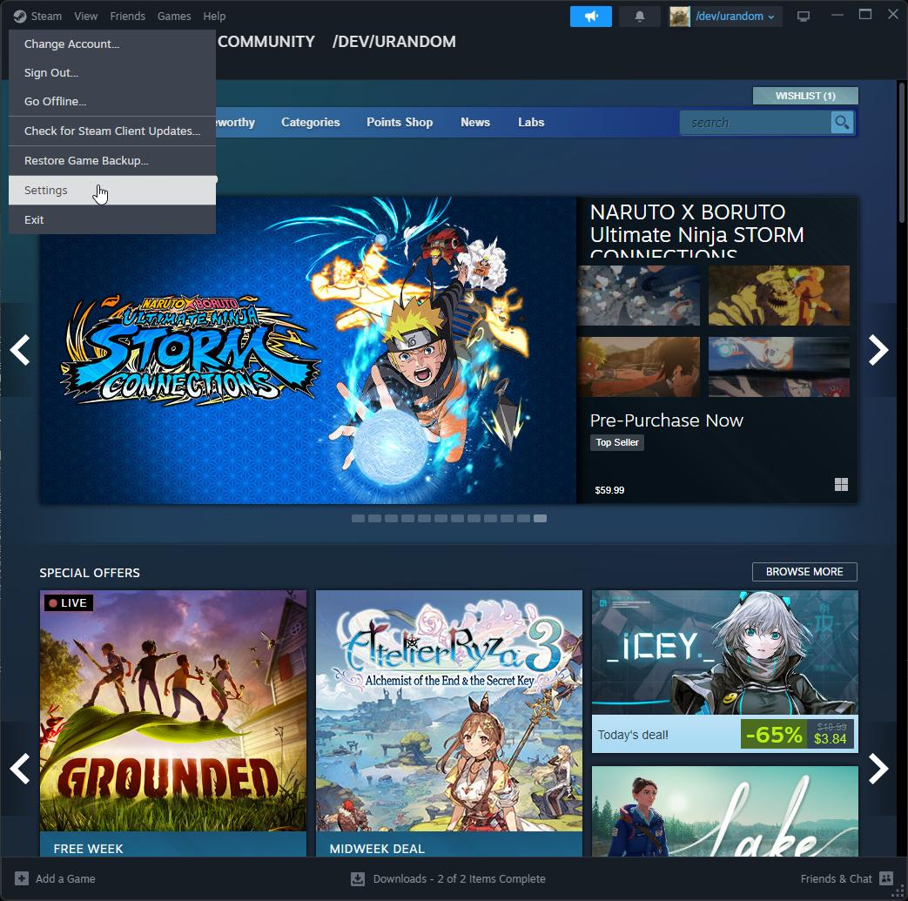

From here, click the "Remote Play" item from the left menu.


Afterwards, click the "Pair Steam Link" button and enter the PIN you received in the Steam Link application running on your Raspberry Pi!


The Steam Link application should now start connecting and you should see something like below.

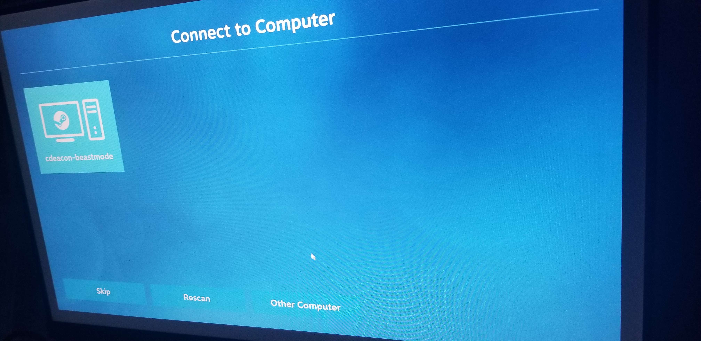

You can hit the "Skip" button unless if you want to try a network test. You should see something like below afterwards indicating that you're ready to stream.

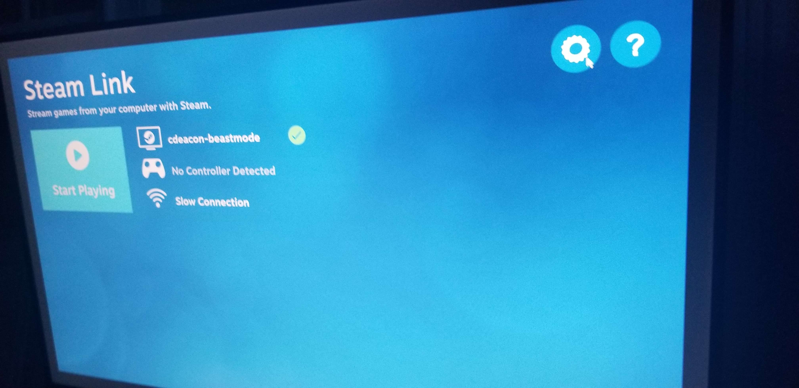

## Configuring Steam Link Settings
On the main Steam Link application page, you will want to click the settings icon in the top-right corner.


From here, you will want to click the "Streaming" button.

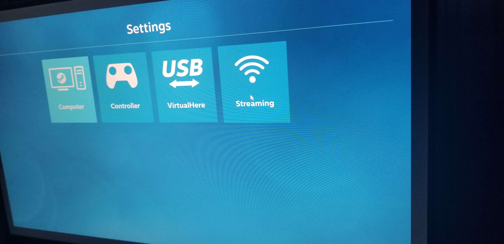

You will now be on page 1/3 for streaming settings. The only option you need to change on here is "Video" from "Balanced" to "Fast". You may not need to do this, but I found at times my controller would have input lag on any options other than "Fast", even though display latency and frame loss were low.


Next, you'll want to click the "More..." button in the middle-bottom area. This will take you to page 2/3.

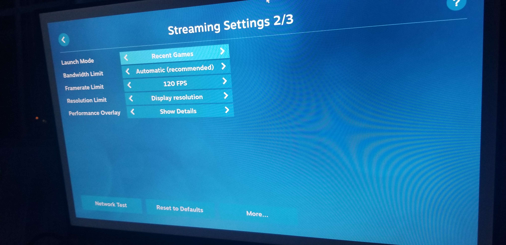

On this page, you'll want to set your framerate limit manually if you're trying to stream above 60 FPS. I also enabled "Show Details" on "Performance Overlay" so that I could see graphs/stats for performance. I'd recommend enabling that option while setting the Steam Link up to make troubleshooting easier and then disable it later on if you confirm things are running smoothly.

If you set "Bandwidth Limit" to "Unlimited", you will most likely experience high display latency and frame loss issues, especially with controllers like I experienced and documented [here](https://github.com/gamemann/Steam-Link-Setup-And-Issues-On-Raspberry-Pi/issues/1).

If you click the "More..." button again, you'll come to page 3/3. I didn't change any settings here because I didn't need to, but you can try adjusting settings if you'd like.

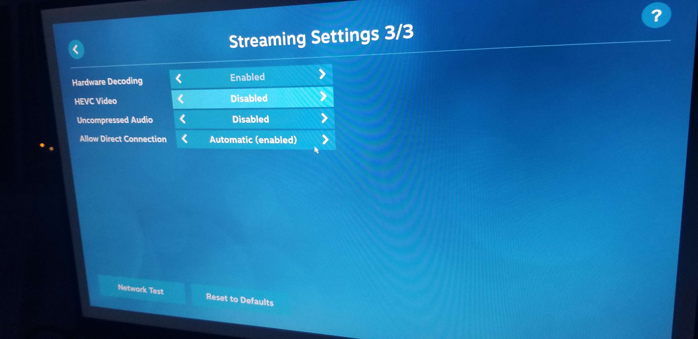

## Automatically Starting Steam Link
You can create a `systemd` service to automatically start Steam Link on startup. Make sure you've enabled Auto Login and OpenSSH as documented above before automatically starting Steam Link, though.

You can create a `systemd` service file for Steam Link using Nano via the `nano /etc/systemd/system/steamlink.service` command.

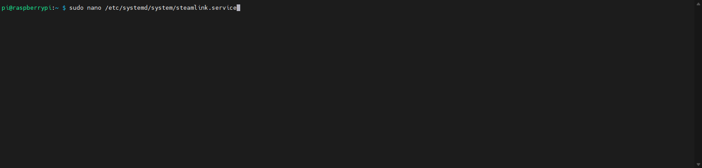

Afterwards, you can paste the following in the file.

```
[Unit]
Description=Steam Link

[Service]
Type=simple
User=pi
ExecStart=/usr/bin/steamlink
Restart=always

[Install]
WantedBy=multi-user.target
```

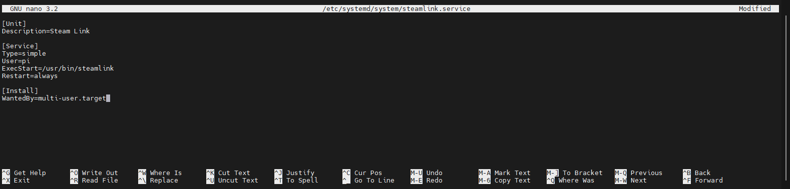

Please note that `Restart=always` will automatically restart Steam Link when it is manually closed. I added this to the service file because I kept accidently closing Steam Link using my controller and was annoyed manually starting it afterwards each time. I would also recommend having OpenSSH enabled if you have this setting enabed since you will need to wait until the fail count is reached before `systemd` stops automatically restarting Steam Link which would be very annoying to deal with on the main TTY (even switching between different TTY's is impacted by this).

You may hit `CTRL` + `X` and then `Y` to save the file.

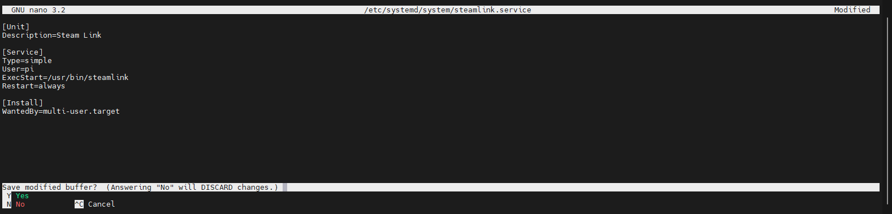

To enable the service on boot, you need to execute the following command.

```bash
sudo systemctl enable steamlink
```

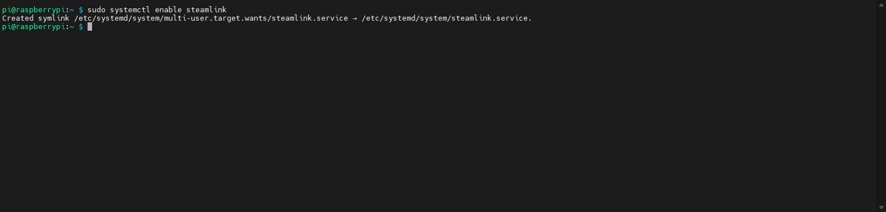

If you want to disable the service, you can use the following command instead.

```bash
sudo systemctl disable steamlink
```

You may now reboot the Raspberry Pi device and see if it automatically logs into the user and starts Steam Link.


## Credits
* [Christian Deacon](https://github.com/gamemann)