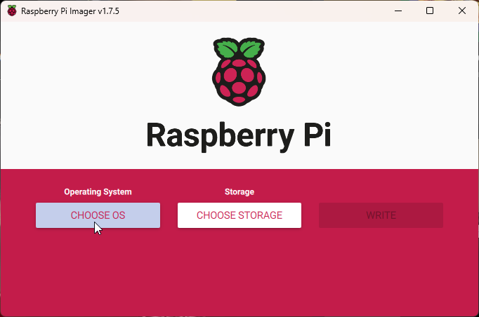

# Setting Up Steam Link On A Raspberry Pi 4 Model B Device
For the last week or so, I've been trying to setup [Steam Link](https://store.steampowered.com/app/353380/Steam_Link/) on my [Raspberry Pi 4 Model B](https://www.amazon.com/Raspberry-Model-2019-Quad-Bluetooth/dp/B07TC2BK1X) devices. Along the way, I've ran into a few issues, some in which are documented in a separate GitHub repository I made [here](https://github.com/gamemann/Steam-Link-Setup-And-Issues-On-Raspberry-Pi). Unfortunately, I found that information on the Internet related to setting up Steam Link on a Raspberry Pi is very scattered and scarce, especially when wanting to stream at **120 FPS/Hz**, which is still fairly new to Steam Link. With that said, I also found that newer OS releases of the Raspberry Pi OS either have bad performance with Steam Link or doesn't work at all. That is why we will be using a legacy version of Raspberry Pi OS, **Buster Lite**, which runs on 32-bit.

**Disclaimer** - I apologize for any pictures that have bad quality when taken from my phone.

## Flashing MicroSD Card & Installing Raspberry Pi OS
As mentioned in the overview, we will be using Raspberry Pi OS **Buster Lite** in this guide. This is because from the experiments I've concluded, Steam Link on Bookworm has broken packages and Steam Link on Bullseye has noticeably bad performance (high display latency and frame loss).

### Download & Install Raspberry Pi Imager
Firstly, you'll want to download Raspberry Pi Imager from [here](https://www.raspberrypi.com/software/). This program allows you to flash your MicroSD card with a new Raspberry Pi OS.

### Download Raspberry Pi OS Buster Lite
Next, you'll want to download Raspberry Pi OS Buster Lite image file from [here](https://downloads.raspberrypi.org/raspios_oldstable_lite_armhf/images/raspios_oldstable_lite_armhf-2022-04-07/). A direct link may be found [here](https://downloads.raspberrypi.org/raspios_oldstable_lite_armhf/images/raspios_oldstable_lite_armhf-2022-04-07/2022-04-04-raspios-buster-armhf-lite.img.xz). 

After downloading the file, you will need to extract the file using a program such as [7-Zip](https://www.7-zip.org/) that supports uncompressing `.xz` files.

### Flash Raspberry Pi OS Buster Lite
Now you'll want to open Raspberry Pi Imager. You should see something like below.

